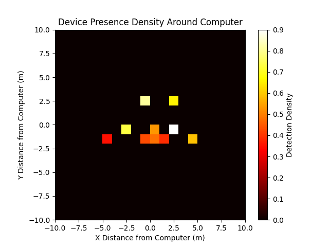

# RabbiDisc - Bluetooth Device Tracker



A tool for tracking Bluetooth devices using Bleak library on Arch Linux.

## Features
- 📡 Real-time detection of nearby Bluetooth devices
- 📏 Average distance calculation
- 🔥 Signal strength heatmap generation
- ⚠️ Threshold-based alerts

## Installation

```bash
# Clone repository
git clone https://github.com/DanielOM999/RabbiDisc.git
cd RabbiDisc

# Create virtual environment (recommended)
python -m venv .venv
source .venv/bin/activate

# Install dependencies
pip install -r requirements.txt

## Arch Linux specific
sudo pacman -S bluez bluez-utils
```

## Usage
```bash
# List available devices
python3 deviceLister.py

# Calculate average distance
python3 avragedistanceCal.py

# Generate heatmap
python3 heatmapVirt.py

# Monitoring mode with alerts
python3 warn.py
```

## Project Structure
```
.
├── deviceLister.py    # Main device detection script
├── avragedistanceCal.py # Distance calculations
├── heatmapVirt.py     # Heatmap visualization
├── warn.py            # Alert system
├── requirements.txt   # Dependencies
└── heatmap.png        # Example visualization
```

## Dependencies
- [Bleak](https://github.com/hbldh/bleak) (BLE communication)
- NumPy & Matplotlib (data processing/visualization)
- SciPy & Pandas (advanced analysis)
- BlueZ (Arch Linux Bluetooth stack)

## License
MIT License - see [LICENSE](LICENSE) for details

## Contributing
Contributions welcome! Please open an issue or submit a PR.
